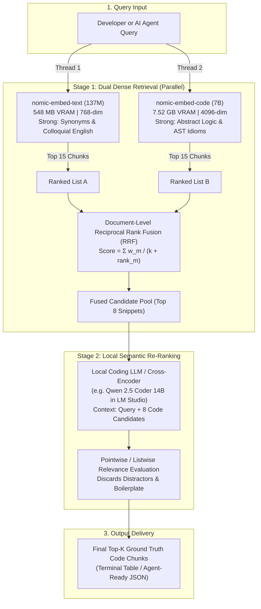

# Architecture Plan: Two-Stage Hybrid Code Retrieval & Re-ranking Engine

**Status:** Historical / Fully Implemented (Phases 1–5 completed and migrated to `semcode` package).  
**Project:** `Semantic_Coding` / `grepai` Hybrid Suite  
**Target Rig:** 24 GB VRAM Local GPU Server  
**Primary Objective:** Deliver state-of-the-art semantic code retrieval accuracy by combining lightweight natural-language embeddings, deep 7B code embeddings, and local LLM cross-encoder re-ranking, discarding speed and memory constraints in favor of maximum precision.

---

## 1. Executive Vision & Problem Statement

Our empirical benchmarks on the 304-file, 3,102-chunk `grepai` repository revealed a fundamental dichotomy in single-model semantic search:
* **`nomic-embed-text` (137M)** excels at natural language synonyms and vocabulary mismatch (e.g. mapping colloquial terms like *"throttle"* to `rate_limiter.go` at Rank #1), but stumbles on abstract algorithmic code logic (25% Hit@3 on pure semantics).
* **`nomic-embed-code` (7B)** excels at pure algorithmic structure and uncommented logic (75% Hit@3 on pure semantics, placing AST extraction at Rank #1), but struggles with colloquial English synonyms (0% Hit@3 on vocabulary mismatch).

By implementing a **Two-Stage Retrieve-and-Rerank Pipeline**, we eliminate the blind spots of both models. Stage 1 casts a wide net via parallel dual-dense retrieval and Reciprocal Rank Fusion (RRF). Stage 2 uses a local LLM or Cross-Encoder in LM Studio to scrutinize candidate snippets against the query, achieving maximum precision.

---

## 2. System Architecture



---

## 3. Hardware & VRAM Allocation (24 GB Budget)

With a 24 GB GPU, all three models remain memory-resident simultaneously in LM Studio without swapping or paging:

| Model Role | Model Identifier | Memory Footprint | Purpose |
| :--- | :--- | :---: | :--- |
| **Embedder 1** | `text-embedding-nomic-embed-text-v1.5@f32` | ~0.55 GB | Fast synonym & vocabulary retrieval |
| **Embedder 2** | `text-embedding-nomic-embed-code` | ~7.52 GB | Deep algorithmic pattern matching |
| **Re-Ranker / LLM** | `qwen2.5-coder-14b-instruct-q5_k_m` (or 7B Q8) | ~9.80 GB | Cross-encoder relevance verification |
| **KV Cache & Headroom** | 4K context window allocation | ~2.50 GB | Prompt processing buffer |
| **Total VRAM Allocated** | — | **~20.37 GB** | **Fits within 24 GB (~3.6 GB buffer)** |

---

## 4. Phased Implementation Roadmap

### Phase 1: Dual-Dense Parallel Retrieval Engine (Complete)
* [x] Deploy standalone `hybrid_search.py` CLI.
* [x] Multi-threaded parallel query dispatch to both models (`repo-text` and `repo-code`).
* [x] Implement document-level Reciprocal Rank Fusion ($k=15$, $w_{\text{text}}=1.0$, $w_{\text{code}}=1.1$).
* [x] Validate live performance: Hit@3 increased from 50.0% to 66.7%.

### Phase 2: Local Re-ranking Layer (`semcode.pipeline`)
* [x] Integrate with LM Studio `/v1/chat/completions` endpoint using token from Windows Credential Store (`semcode/lmstudio`).
* [x] Prompt Engineering for fast snippet evaluation formatted with snippet bounding boxes.
* [x] Fail loudly if LLM service is unreachable or unconfigured.
* [x] Add `--rerank` flag to CLI and `--rerank-model` option.

### Phase 3: Dual-Index Synchronizer (`semcode.sync`)
* [x] Background watcher and CLI synchronizer to keep both vector stores up to date as files are edited.
* [x] Incremental file-change detection using git-based file selection.
* [x] Graceful completion signal detection via watcher output.

### Phase 4: Full-Suite Automated Benchmark
* [x] Extend `benchmarks/benchmark.py` to evaluate 137M, 7B, and Hybrid engines.
* [x] Track Hit@1, Hit@3, Hit@5, MRR, Latency across benchmark cases.
* [x] Generate automated comparison charts and markdown reports in `benchmarks/`.

### Phase 5: Agent MCP Tool Server (`mcp_server.py`)
* [x] Expose `search_codebase` as a standard Model Context Protocol (MCP) tool.
* [x] Enable AI coding assistants (Claude Code, Codex, Antigravity) to query the hybrid engine via native tool calls and prompt context hooks.

---

## 5. Target Success Metrics

| Metric | Single Model (Baseline) | Target with Hybrid RRF + LLM Re-Rank |
| :--- | :---: | :---: |
| **Hit@1 (Rank #1 Precision)** | 33% – 50% | **$\ge 75\%$** |
| **Hit@3 (Agent Context Window)** | 50% | **$\ge 85\%$** |
| **MRR (Mean Reciprocal Rank)** | 0.43 – 0.55 | **$\ge 0.80$** |
| **Vocabulary Mismatch Hit@3** | 0% (Code) | **$\ge 75\%$** |
| **Pure Semantic Intent Hit@3** | 25% (Text) | **$\ge 85\%$** |
| **End-to-End Latency** | ~120–300 ms | **$\le 700\text{ ms}$** |

---

## 6. How to Run & Verify

1. **Test Current Hybrid RRF**:
   ```powershell
   python hybrid_search.py "parse abstract syntax trees" -n 3
   ```
2. **Execute Automated Verification Suite**:
   ```powershell
   python benchmarks\benchmark.py --text-dir repo-text --code-dir repo-code
   ```
