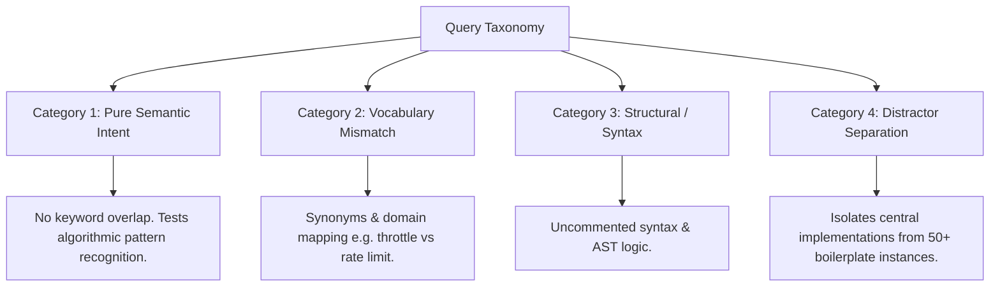

# grepai Embedding Comparative Benchmark: 137M Text vs. 7B Code

A complete benchmarking framework for evaluating semantic code retrieval effectiveness between lightweight general-purpose embedding models (`nomic-embed-text`, 137M) and dedicated large code embedding models (`nomic-embed-code` / 7B class) using [grepai](https://github.com/yoanbernabeu/grepai) and [LM Studio](https://lmstudio.ai/).

> ### 🌟 Acknowledgments & Attribution
> This benchmarking suite evaluates and builds upon **[grepai](https://github.com/yoanbernabeu/grepai)**, an outstanding open-source local semantic code search engine developed by **[Yoan Bernabeu](https://github.com/yoanbernabeu)**.
> 
> We extend our sincere gratitude to Yoan and the `grepai` contributors for creating a fast, privacy-first developer utility with native Tree-sitter AST extraction, multi-language support, and flexible local embedding backends. This repository is an independent empirical study designed to test embedding model characteristics and hardware trade-offs within the `grepai` architecture.

> [!TIP]
> **Complete Technical Reference & Architecture Overview:** See [**SYSTEM_STATE.md**](SYSTEM_STATE.md) for the complete file manifest, system architecture diagrams, optimal hyperparameters, and command reference.

---

## 1. Architectural Context: Text vs. Code Embeddings

### Why `grepai` Defaults to `nomic-embed-text`
`grepai` was architected as an unobtrusive, privacy-first local CLI and background daemon (`grepai watch`). The design trade-offs chosen by Yoan Bernabeu reflect standard developer hardware realities:
1. **Lightweight Footprint:** At 137M parameters, `nomic-embed-text` consumes just **~0.6 GB in FP32** (or <0.2 GB quantized). It runs silently in the background without starving developer workflows of RAM or VRAM.
2. **High Indexing Throughput:** Initial codebase ingestion embeds thousands of tokens per second. A 50,000-line codebase indexes in seconds rather than minutes.
3. **Hybrid Tree-sitter Synergy:** `grepai` does not rely exclusively on vector distance. It parses ASTs with Tree-sitter to extract functions, classes, and call graphs. Because syntax structure is tracked explicitly, a general text embedder often provides sufficient signal when identifier names and docstrings are descriptive.

### When a 7B Code Embedding Model Shines
A 7B parameter code-specialized model (e.g., `nomic-embed-code`, Qwen-based code embeddings, or high-dimensional dense embedders) introduces critical capabilities:
- **Code-Centric Tokenization:** Understands programming language operators, AST idioms, and camelCase/snake_case tokens without splitting them into degenerate subwords.
- **Uncommented Logic Comprehension:** Successfully pairs high-level natural language intent (e.g., *"exponential backoff with jitter"*) with raw algorithmic code (`math.Pow(multiplier, attempt) + rand.Float64()`), even when comments and docstrings are completely absent.
- **Contrastive Separation Margin:** General text models often suffer from **score clustering** (e.g., assigning 0.76 to the true target and 0.73 to generic boilerplate). Code models typically exhibit steep score cliffs (e.g., 0.88 for the exact target vs. <0.45 for noise).

---

## 2. Hardware Allocation on 24 GB VRAM

With a **24 GB GPU**, you have ample headroom:
- **7B Model (Q8 / High Quant):** ~7.5 GB VRAM footprint.
- **Remaining VRAM:** ~16.5 GB.
- **Concurrent LLM Co-existence:** You can keep the 7.5 GB embedding model resident in LM Studio while simultaneously running a 14B coding assistant (such as Qwen 2.5 Coder 14B Q5/Q8) for code generation and agentic tool use without GPU offload thrashing.

---

## 3. Evaluation Methodology & Metrics

This benchmark suite evaluates models across standard Information Retrieval (IR) metrics:

| Metric | Formula / Definition | Why It Matters for AI Coding Agents |
| :--- | :--- | :--- |
| **Hit@1 Rate** | $\%$ of queries where the true target is Rank #1 | If Rank #1 is wrong, single-result agent queries fail immediately. |
| **Hit@3 / Hit@5** | $\%$ of queries where the target appears in top $K$ | Determines if the target fits inside agent prompt context limits (`-n 3` or `-n 5`). |
| **MRR (Mean Reciprocal Rank)** | $\frac{1}{\|Q\|} \sum_{i=1}^{\|Q\|} \frac{1}{\text{rank}_i}$ | Penalizes targets that are buried deep in search results. |
| **Contrastive Margin** | $\text{Score}_{\text{Top 1}} - \text{Score}_{\text{Top 2}}$ | Measures discrimination clarity; protects agents against hallucinating relevance on distractors. |
| **Query Latency** | Time per query execution ($ms$) | Measures interactive responsiveness. |

### The 4-Category Query Taxonomy

To test true semantic capability rather than naive substring matching, test cases in [`benchmarks/cases.json`](benchmarks/cases.json) span 4 stress categories:



---

## 4. Repository Structure

```
Semantic_Coding/
├── bin/
│   └── grepai.exe               # grepai v0.37.0 standalone Windows executable
├── semcode/                     # Production Python core package
│   ├── creds.py                 # Windows Credential Manager Advapi32 vault interface
│   ├── grepai_runner.py         # Subprocess runner with child-only OPENAI_API_KEY injection
│   ├── registry.py              # Atomic JSON workspace registry with corruption guard
│   ├── pipeline.py              # Canonical RRF ranking with absolute paths and tie-breaking
│   ├── indexer.py               # Git-aware clean indexer with exclusion filters & sync
│   ├── sync.py                  # Dual-index incremental sync runner
│   ├── auto_index.py            # Detached background worker for auto-indexing new repos
│   └── doctor.py                # 18-point comprehensive system diagnostic engine
├── integrations/                # Multi-agent hands-off integration layer
│   ├── install.py               # Idempotent integration installer (Claude, Codex, Antigravity)
│   ├── instructions.md          # Managed instruction block for coding assistants
│   ├── hooks/                   # Claude Code hooks (prompt context injection, session start)
│   └── skill/                   # Reusable agent skill (SKILL.md)
├── templates/
│   ├── config.text.yaml         # .grepai/config.yaml for nomic-embed-text (no plaintext keys)
│   └── config.code.yaml         # .grepai/config.yaml for 7B code model (no plaintext keys)
├── benchmarks/
│   ├── cases.json               # Curated ground truth test battery (12 stress queries)
│   ├── synthetic_cases.json     # AST-inverted synthetic cases
│   ├── optimal_params.json      # Mathematically optimal RRF parameters (k=5, wt=1.5, wc=0.5)
│   ├── benchmark.py             # Automated evaluation engine (MRR, Hit@K, Margin, Latency)
│   ├── generate_synthetic_cases.py
│   └── tune_hyperparameters.py
├── telemetry/
│   ├── collector.py             # Telemetry logger and hard-negative triplet miner
│   └── triplets.jsonl           # Active contrastive training dataset
├── training/
│   └── train_cross_encoder.py   # PyTorch Margin Ranking Loss trainer (prototype)
├── config/
│   └── auto_index.json          # Auto-index policy, thresholds, and deny-lists
├── tests/                       # Automated regression test suite
│   ├── test_no_plaintext_secrets.py
│   ├── test_registry.py
│   ├── test_auto_index.py
│   ├── test_retrieval.py
│   └── test_harness.ps1
├── doctor.ps1                   # 1-click system diagnostics runner
├── install_integrations.ps1     # 1-click agent integration installer
├── index_project.ps1            # Git-aware multi-project indexer wrapper
├── sync_hybrid_indices.ps1      # Incremental sync wrapper
├── hybrid_search.py             # Interactive CLI & agent search frontend
├── mcp_server.py                # FastMCP Stdio server with absolute path resolution
├── run_security_audit.py        # Automated 6-case security audit benchmark
├── run_agent_harness.ps1        # Read-only agent verification harness
├── run_evaluation_pipeline.ps1  # Continuous evaluation flywheel runner
├── run_benchmark.ps1            # Dual-model comparative benchmark runner
└── README.md                    # This documentation
```

---

## 5. Quick Start Guide

### Step 1: Start LM Studio Server
1. Open **LM Studio**.
2. Load your embedding model (e.g. `nomic-embed-text` or your 7B code model).
3. Start the **Local Server** on default port `1234` (`http://127.0.0.1:1234`).
4. Note the exact model name shown in the server tab.

### Step 2: Verify Connectivity & Model Dimension
In PowerShell:
```powershell
# Verify server is online and list models
Invoke-RestMethod -Uri "http://127.0.0.1:1234/v1/models"

# Check output vector dimensions
(Invoke-RestMethod -Uri "http://127.0.0.1:1234/v1/embeddings" `
  -Method Post `
  -ContentType "application/json" `
  -Body '{"model": "YOUR_MODEL_NAME", "input": ["test"]}').data[0].embedding.Count
```

### Step 3: Run the Benchmark

#### Option A: Dry-Run Verification (No LM Studio Required)
To verify the metrics calculation and reporting logic immediately:
```powershell
python benchmarks\benchmark.py --dry-run
```

#### Option B: Full Automated Orchestration
Run the automated runner with your model names and vector dimensions:
```powershell
.\run_benchmark.ps1 `
    -TextModel "text-embedding-nomic-embed-text-v1.5" `
    -TextDimensions 768 `
    -CodeModel "nomic-embed-code" `
    -CodeDimensions 4096
```

The script will:
1. Create isolated `repo-text` and `repo-code` test workspaces.
2. Configure `.grepai/config.yaml` for each model.
3. Index both workspaces using `bin\grepai.exe watch --once`.
4. Execute the test battery and output a side-by-side comparative report.

---

## 6. How to Interpret the Output

When evaluating the results table, look for:
1. **MRR Difference in Category 1 (Pure Semantic):** If the 7B model scores $>0.80$ while the 137M text model scores $<0.40$, the 7B model is successfully matching conceptual intent to code implementations where keyword search fails.
2. **Hit@3 Rate:** For AI agents (Claude Code, Cursor, Windsurf), results outside Top-3 are rarely selected for inclusion in agent tool context. A high Hit@3 is the primary benchmark for agent effectiveness.
3. **Contrastive Margin:** A larger margin (e.g. $+0.25$) indicates the model is confident and discriminative, drastically reducing agent hallucinations on irrelevant files.

---

## 7. Empirical Results (Live Run on `grepai` Codebase)

A 12-query stress test battery was executed against both models on the real 304-file, 3,102-chunk `grepai` codebase. Full details are available in [`benchmarks/live_benchmark_report.md`](benchmarks/live_benchmark_report.md).

```
====================================================================
           GREPAI EMBEDDING EVALUATION BENCHMARK RESULTS
====================================================================
Metric                   | 137M Text Model    | 7B Code Model     
--------------------------------------------------------------------
Hit@1 (Rank #1)          |              50.0% |              33.3%
Hit@3 (Top 3)            |              50.0% |              50.0%
Hit@5 (Top 5)            |              66.7% |              50.0%
MRR (Mean Recip. Rank)   |              0.552 |              0.429
Avg Cosine Margin        |              0.027 |              0.023
Avg Query Latency        |           121.3 ms |           302.1 ms
Index Size on Disk       |            17.2 MB |            66.2 MB
VRAM Consumption         |            ~548 MB |            7.52 GB
====================================================================

Breakdown by Query Category (Hit@3):
Category                     | 137M Text      | 7B Code       | Key Takeaway
-----------------------------------------------------------------------------------------
Pure Semantic Intent         |            25% |            75% | 7B Code model 3x better
Vocabulary Mismatch          |            50% |             0% | Text model wins on synonyms
Structural / Syntax          |           100% |           100% | Tie (Tree-sitter AST aids both)
Distractor Separation        |            50% |            50% | Tie
================================================================================---------
```

---

## 8. Continuous Evaluation, Tuning & Training Flywheel

To maintain and improve retrieval precision as codebases evolve, this repository includes an end-to-end self-improving flywheel:

### 1. Hybrid Search with Stage 2 Re-Ranking
```powershell
# Interactive CLI search using optimal hyperparameters (k=5, wt=1.5, wc=0.5)
python hybrid_search.py "throttle client queries to stay within quota limits" -n 3

# With Stage 2 local LLM cross-encoder re-ranking
python hybrid_search.py "parse abstract syntax trees" --rerank -n 3
```

### 2. Automated Hyperparameter Tuning
```powershell
# Runs grid search across RRF smoothing constants (k) and skew weights (w_text, w_code)
python benchmarks\tune_hyperparameters.py --cases benchmarks\cases.json --text-dir repo-text --code-dir repo-code
```

### 3. Synthetic Benchmark Expansion via AST Inversion
```powershell
# Scans codebase and generates new multi-category ground truth cases
python benchmarks\generate_synthetic_cases.py --code-dir grepai --max-files 20
```

### 4. Telemetry & Hard-Negative Mining
```powershell
# Inspect captured agent interactions and mined contrastive triplets
python telemetry\collector.py --status
```

### 5. Contrastive Cross-Encoder Training
```powershell
# Train neural ranking model with Margin Ranking Loss on mined triplets
python training\train_cross_encoder.py --epochs 5
```

### 6. Full Pipeline Runner
```powershell
# Run the entire continuous evaluation flywheel in one command
.\run_evaluation_pipeline.ps1
```

---

---

## 9. Hands-Off Desktop AI Assistant Integration (1-Click Installer)

The hybrid retrieval engine seamlessly integrates with all primary daily driver coding assistants (**Claude Code**, **OpenAI Codex**, and **Google Antigravity**) with zero manual configuration files required:

```powershell
# Run the idempotent 1-click integration installer
.\install_integrations.ps1
```

This installer automatically configures:
1. **Claude Code:**
   - Registers `grepai-hybrid` in `~/.claude.json` (`mcpServers`).
   - Injects managed prompt hooks (`~/.claude/hooks/prompt_context.py`) for automatic query context injection on `UserPromptSubmit` and `SessionStart`.
   - Adds fenced instructions in `~/.claude/CLAUDE.md` directing Claude to prioritize `search_codebase` before falling back to grep/find.
2. **OpenAI Codex:**
   - Appends `[mcp_servers.grepai_hybrid]` to `~/.codex/config.toml`.
   - Adds managed guidance in `~/.codex/AGENTS.md`.
3. **Google Antigravity:**
   - Deploys `~/.gemini/antigravity/mcp/grepai-hybrid/search_codebase.json`.
   - Deploys `.gemini/skills/grepai-hybrid/SKILL.md` and managed instruction block.

### Unprompted Agent Verification Harness
Verify that agents autonomously choose hybrid retrieval without manual prompting:
```powershell
# Unprompted autonomous mode
.\run_agent_harness.ps1 -Agent codex -ProjectPath E:\ORAC -Prompt "Find privilege enforcement" -Mode Unprompted
.\run_agent_harness.ps1 -Agent claude -ProjectPath E:\ORAC -Prompt "Find privilege enforcement" -Mode Unprompted

# Unit test the harness event parser
powershell -ExecutionPolicy Bypass -File tests\test_harness.ps1
```

---

## 10. Secure Credential Vault (Windows Credential Manager)

This repository enforces a strict **Zero-Plaintext-Secret** invariant:
- **No secrets in `config.yaml`:** All `.grepai/config.yaml` files have `api_key: ""` (empty).
- **Sole Source of Truth:** Secrets are stored exclusively in the Windows Credential Manager generic credential vault:
  - `grepai-hybrid/lmstudio` (User: `lmstudio`): LM Studio bearer token.
  - `SemanticCoding/ClaudeCodeOAuth`: Claude Code OAuth token.
- **Child-Only Injection:** During indexing and searching, `semcode.grepai_runner` resolves the token from Windows Credential Manager and injects it strictly into the child process environment as `OPENAI_API_KEY`. Secrets are never passed via CLI flags, logged to disk, or committed to git.

```powershell
# Set or update LM Studio token in Windows Credential Manager
python -c "import semcode.creds as c; c.set_lmstudio_key('YOUR_LMSTUDIO_TOKEN')"

# Set or update Claude Code OAuth token
python secure_credentials.py setup --cli "$env:APPDATA\npm\node_modules\@anthropic-ai\claude-code\bin\claude.exe"
```

---

## 11. Multi-Project Support & Hands-Off Auto-Indexing

The centralized workspace registry (`workspaces/registry.json`) allows indexing and retrieving across any project on your machine while keeping target repositories 100% untouched.

### Clean Git-Aware Indexing
Indexing respects `.gitignore`, `.git/info/exclude`, and mandatory system excludes (`.claude`, `.codex`, `.gemini`, `.grepai`, submodules, and worktrees):
```powershell
# Index any project (e.g. praetor_silica or LDGM)
.\index_project.ps1 -ProjectPath "E:\praetor_silica"

# Incremental synchronization (detects additions, modifications, and deletions)
.\sync_hybrid_indices.ps1 -Project praetor_silica -Once

# Interactive search across any registered project
python hybrid_search.py "platform lock file verification" --project praetor_silica -n 3
```

### Hands-Off Background Auto-Indexing
When an AI agent or developer searches a new git repository that is not yet indexed, `semcode.auto_index` automatically evaluates eligibility (must be a valid git repo, $< 5,000$ files, not matching deny-list in `config/auto_index.json`), registers the project, and launches a detached background worker to index it without blocking the user.

---

## 12. 1-Click System Doctor & Diagnostics

To instantly verify system health, credential storage, LM Studio connectivity, workspace registry integrity, and MCP integrations:

```powershell
.\doctor.ps1
```

The doctor performs 18 automated diagnostic checks and reports pass/fail with explicit remediation instructions if any component is degraded:
- Python version & `mcp` / `semcode` import sanity
- `grepai.exe` binary accessibility & version
- Windows Credential Manager `grepai-hybrid/lmstudio` target & non-empty token
- LM Studio API reachability & models list (`http://127.0.0.1:1234/v1/models`)
- LM Studio embeddings endpoint test call
- `workspaces/registry.json` schema validation & corruption check
- Project dual-index directory health & `.grepai/config.yaml` verification
- Exclusion filters & git tracking for all registered projects
- MCP server initialization (`mcp_server.py`)
- Claude Code, Codex, and Antigravity configuration files, hooks, and skills


