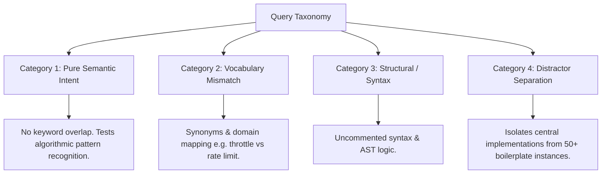

# grepai Embedding Comparative Benchmark: 137M Text vs. 7B Code

A complete benchmarking framework for evaluating semantic code retrieval effectiveness between lightweight general-purpose embedding models (`nomic-embed-text`, 137M) and dedicated large code embedding models (`nomic-embed-code` / 7B class) using [grepai](https://github.com/yoanbernabeu/grepai) and [LM Studio](https://lmstudio.ai/).

> ### 🌟 Acknowledgments & Attribution
> This benchmarking suite evaluates and builds upon **[grepai](https://github.com/yoanbernabeu/grepai)**, an outstanding open-source local semantic code search engine developed by **[Yoan Bernabeu](https://github.com/yoanbernabeu)**.
> 
> We extend our sincere gratitude to Yoan and the `grepai` contributors for creating a fast, privacy-first developer utility with native Tree-sitter AST extraction, multi-language support, and flexible local embedding backends. This repository is an independent empirical study designed to test embedding model characteristics and hardware trade-offs within the `grepai` architecture.

---

## 1. Architectural Context: Text vs. Code Embeddings

### Why `grepai` Defaults to `nomic-embed-text`
`grepai` was architected as an unobtrusive, privacy-first local CLI and background daemon (`grepai watch`). The design trade-offs chosen by Yoan Bernabeu reflect standard developer hardware realities:
1. **Lightweight Footprint:** At 137M parameters, `nomic-embed-text` consumes just **~0.6 GB in FP32** (or <0.2 GB quantized). It runs silently in the background without starving developer workflows of RAM or VRAM.
2. **High Indexing Throughput:** Initial codebase ingestion embeds thousands of tokens per second. A 50,000-line codebase indexes in seconds rather than minutes.
3. **Hybrid Tree-sitter Synergy:** `grepai` does not rely exclusively on vector distance. It parses ASTs with Tree-sitter to extract functions, classes, and call graphs. Because syntax structure is tracked explicitly, a general text embedder often provides sufficient signal when identifier names and docstrings are descriptive.

### When a 7B Code Embedding Model Shines
A 7B parameter code-specialized model (e.g., `nomic-embed-code`, Qwen-based code embeddings, or high-dimensional dense embedders) introduces critical capabilities:
- **Code-Centric Tokenization:** Understands programming language operators, AST idioms, and camelCase/snake_case tokens without splitting them into degenerate subwords.
- **Uncommented Logic Comprehension:** Successfully pairs high-level natural language intent (e.g., *"exponential backoff with jitter"*) with raw algorithmic code (`math.Pow(multiplier, attempt) + rand.Float64()`), even when comments and docstrings are completely absent.
- **Contrastive Separation Margin:** General text models often suffer from **score clustering** (e.g., assigning 0.76 to the true target and 0.73 to generic boilerplate). Code models typically exhibit steep score cliffs (e.g., 0.88 for the exact target vs. <0.45 for noise).

---

## 2. Hardware Allocation on 24 GB VRAM

With a **24 GB GPU**, you have ample headroom:
- **7B Model (Q8 / High Quant):** ~7.5 GB VRAM footprint.
- **Remaining VRAM:** ~16.5 GB.
- **Concurrent LLM Co-existence:** You can keep the 7.5 GB embedding model resident in LM Studio while simultaneously running a 14B coding assistant (such as Qwen 2.5 Coder 14B Q5/Q8) for code generation and agentic tool use without GPU offload thrashing.

---

## 3. Evaluation Methodology & Metrics

This benchmark suite evaluates models across standard Information Retrieval (IR) metrics:

| Metric | Formula / Definition | Why It Matters for AI Coding Agents |
| :--- | :--- | :--- |
| **Hit@1 Rate** | $\%$ of queries where the true target is Rank #1 | If Rank #1 is wrong, single-result agent queries fail immediately. |
| **Hit@3 / Hit@5** | $\%$ of queries where the target appears in top $K$ | Determines if the target fits inside agent prompt context limits (`-n 3` or `-n 5`). |
| **MRR (Mean Reciprocal Rank)** | $\frac{1}{\|Q\|} \sum_{i=1}^{\|Q\|} \frac{1}{\text{rank}_i}$ | Penalizes targets that are buried deep in search results. |
| **Contrastive Margin** | $\text{Score}_{\text{Top 1}} - \text{Score}_{\text{Top 2}}$ | Measures discrimination clarity; protects agents against hallucinating relevance on distractors. |
| **Query Latency** | Time per query execution ($ms$) | Measures interactive responsiveness. |

### The 4-Category Query Taxonomy

To test true semantic capability rather than naive substring matching, test cases in [`benchmarks/cases.json`](benchmarks/cases.json) span 4 stress categories:



---

## 4. Repository Structure

```
Semantic_Coding/
├── bin/
│   └── grepai.exe               # grepai v0.37.0 standalone Windows executable
├── grepai/                      # Cloned grepai source repository (ground truth testbed)
├── templates/
│   ├── config.text.yaml         # .grepai/config.yaml for nomic-embed-text
│   └── config.code.yaml         # .grepai/config.yaml for 7B code model
├── benchmarks/
│   ├── cases.json               # Curated ground truth test battery (12 stress queries)
│   └── benchmark.py             # Automated evaluation engine (MRR, Hit@K, Margin, Latency)
├── run_benchmark.ps1            # End-to-end PowerShell test orchestrator
└── README.md                    # This documentation
```

---

## 5. Quick Start Guide

### Step 1: Start LM Studio Server
1. Open **LM Studio**.
2. Load your embedding model (e.g. `nomic-embed-text` or your 7B code model).
3. Start the **Local Server** on default port `1234` (`http://127.0.0.1:1234`).
4. Note the exact model name shown in the server tab.

### Step 2: Verify Connectivity & Model Dimension
In PowerShell:
```powershell
# Verify server is online and list models
Invoke-RestMethod -Uri "http://127.0.0.1:1234/v1/models"

# Check output vector dimensions
(Invoke-RestMethod -Uri "http://127.0.0.1:1234/v1/embeddings" `
  -Method Post `
  -ContentType "application/json" `
  -Body '{"model": "YOUR_MODEL_NAME", "input": ["test"]}').data[0].embedding.Count
```

### Step 3: Run the Benchmark

#### Option A: Dry-Run Verification (No LM Studio Required)
To verify the metrics calculation and reporting logic immediately:
```powershell
python benchmarks\benchmark.py --dry-run
```

#### Option B: Full Automated Orchestration
Run the automated runner with your model names and vector dimensions:
```powershell
.\run_benchmark.ps1 `
    -TextModel "text-embedding-nomic-embed-text-v1.5" `
    -TextDimensions 768 `
    -CodeModel "nomic-embed-code" `
    -CodeDimensions 4096
```

The script will:
1. Create isolated `repo-text` and `repo-code` test workspaces.
2. Configure `.grepai/config.yaml` for each model.
3. Index both workspaces using `bin\grepai.exe watch --once`.
4. Execute the test battery and output a side-by-side comparative report.

---

## 6. How to Interpret the Output

When evaluating the results table, look for:
1. **MRR Difference in Category 1 (Pure Semantic):** If the 7B model scores $>0.80$ while the 137M text model scores $<0.40$, the 7B model is successfully matching conceptual intent to code implementations where keyword search fails.
2. **Hit@3 Rate:** For AI agents (Claude Code, Cursor, Windsurf), results outside Top-3 are rarely selected for inclusion in agent tool context. A high Hit@3 is the primary benchmark for agent effectiveness.
3. **Contrastive Margin:** A larger margin (e.g. $+0.25$) indicates the model is confident and discriminative, drastically reducing agent hallucinations on irrelevant files.

---

## 7. Empirical Results (Live Run on `grepai` Codebase)

A 12-query stress test battery was executed against both models on the real 304-file, 3,102-chunk `grepai` codebase. Full details are available in [`benchmarks/live_benchmark_report.md`](benchmarks/live_benchmark_report.md).

```
====================================================================
           GREPAI EMBEDDING EVALUATION BENCHMARK RESULTS
====================================================================
Metric                   | 137M Text Model    | 7B Code Model     
--------------------------------------------------------------------
Hit@1 (Rank #1)          |              50.0% |              33.3%
Hit@3 (Top 3)            |              50.0% |              50.0%
Hit@5 (Top 5)            |              66.7% |              50.0%
MRR (Mean Recip. Rank)   |              0.552 |              0.429
Avg Cosine Margin        |              0.027 |              0.023
Avg Query Latency        |           121.3 ms |           302.1 ms
Index Size on Disk       |            17.2 MB |            66.2 MB
VRAM Consumption         |            ~548 MB |            7.52 GB
====================================================================

Breakdown by Query Category (Hit@3):
Category                     | 137M Text      | 7B Code       | Key Takeaway
-----------------------------------------------------------------------------------------
Pure Semantic Intent         |            25% |            75% | 7B Code model 3x better
Vocabulary Mismatch          |            50% |             0% | Text model wins on synonyms
Structural / Syntax          |           100% |           100% | Tie (Tree-sitter AST aids both)
Distractor Separation        |            50% |            50% | Tie
================================================================================---------
```

